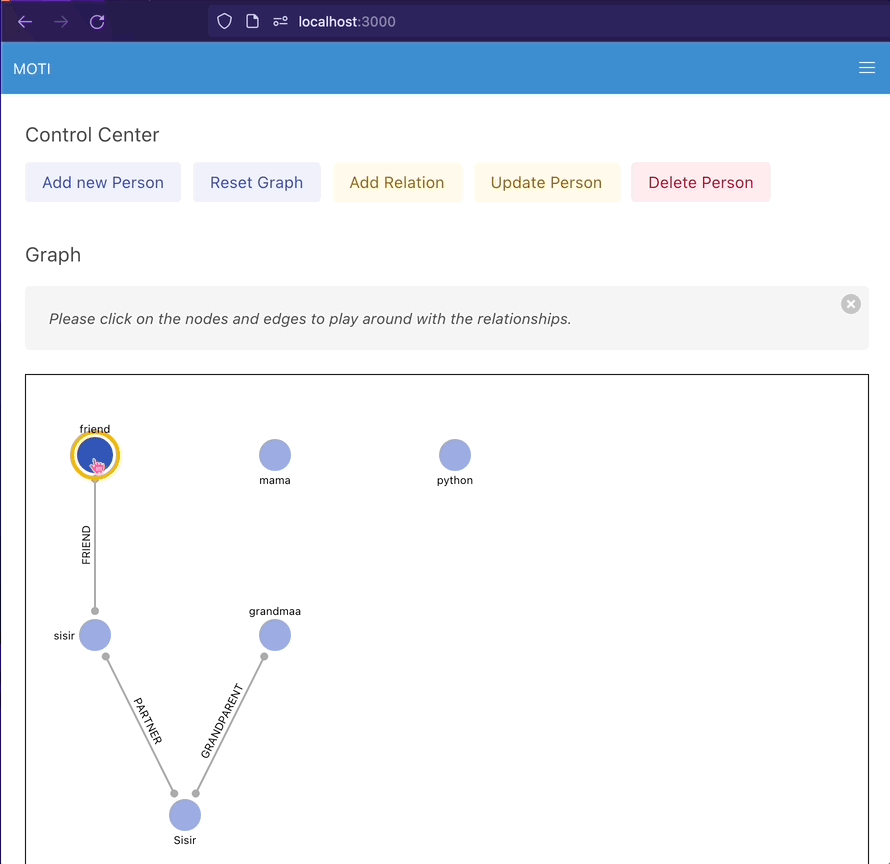
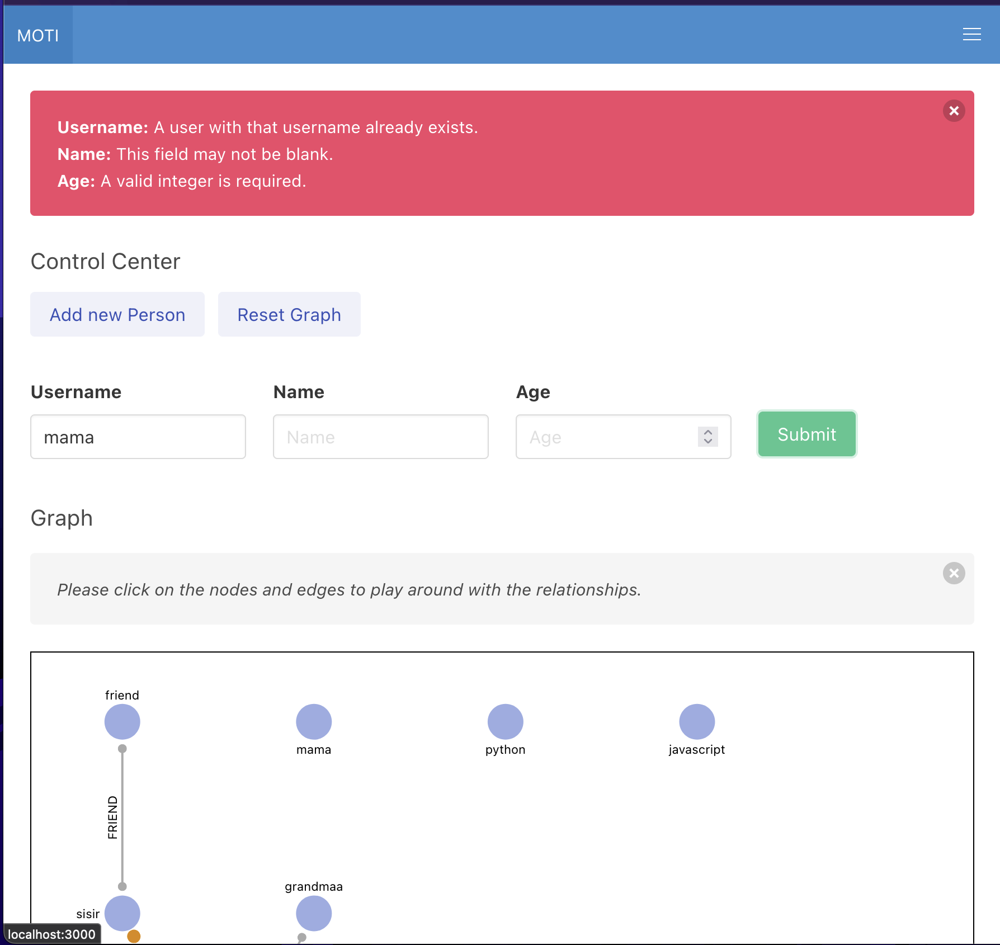

### BC Public Service, Ministry of Transportation, and Infrastructure
---

### Written Assessment (Full Stack Development)

#### Challenge:

Consider the following example relationships among people:

- Parents: A person can have one or two parents.

- Grandparents: A person can have zero or more grandparents.

- Partners: A person can have zero or more partners.

- Children: A person can have zero or more children.

- Friends: A person can have multiple friends.

### DB Design:
---

Table: User

- username
- name
- age

Table: UserRelation (M2M) to User

- source
- target
- relation (GRANDPARENT, PARENT, FRIEND, CHILD)

A User can have 0 or multiple relation with themselves.

---

### Backend Requirements

- ✅ Fetch all people and their relationships.
Please follow [http://localhost:8000/users/nodes/](http://localhost:8000/users/nodes/)

- ✅ Create a new person.
Please follow [http://localhost:8000/users/](http://localhost:8000/users/)

- ✅ Update an existing person.
Please follow [http://localhost:8000/users/[user_id]/](http://localhost:8000/users/1/)
- ✅ Delete a person (including their relationships).
Please follow [http://localhost:8000/users/[user_id]/](http://localhost:8000/users/1/)
- ✅ Fetch relationships of a person.
Please follow [http://localhost:8000/users/nodes/](http://localhost:8000/users/nodes/)
- ✅ Create a new relationship between two people.
Please follow [http://localhost:8000/relation/](http://localhost:8000/relation/)

- ✅ Delete a relationship between two people.
Please follow [http://localhost:8000/relation/[relation_id]/](http://localhost:8000/relation/1/)

### Frontend requirements:

Visualization of People Relationships:

- ✅ Display the relationships among people in the form of a graph.

- ✅ Represent each person as a node in the graph, with lines connecting related individuals.

- ✅ The user can interact with the graph by clicking the nodes or links.

- ✅ The graph should dynamically update when new people or relationships are added or existing ones are edited or removed.

Add, Edit, and Delete People:

- ✅ Provide a user interface to add new people to the graph.
- ✅ Allow users to edit existing information, such as name, age, relation, or contact details.
- ✅ Implement a mechanism to delete people from the graph.

Add, Edit, and Delete Relations:

- ✅ Enable users to define relationships between people (e.g., parent-child, sibling, friend, etc.).

- ✅ Allow users to edit existing relations or delete them if necessary.

Interactive Form for Data Input:

- ✅ Utilize forms to gather user input when adding or editing people and relations.

- ✅ Validate the user input to ensure the data integrity of the graph.

---

### Docker

Please run the following command:

`$ docker-compose up  –build`

---

### Graph Library : [v-network-graph](https://dash14.github.io/v-network-graph/)

